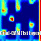

# DQN-tensorflow

Tensorflow implementation of Deep Q-Network (DQN) and Behavior Cloning (BC) to learn how to defeat humans in a FlappyBird game.

### What is include ?
- Tensorflow implementation of DQN similar to the paper <a href="https://deepmind.com/research/publications/human-level-control-through-deep-reinforcement-learning"> Human-level control through deep reinforcement learning</a> [Mnih et al., 2015].
- Some visualization tools for analysing experimental results.
- Possibility to learn from expert dataset (Behavior Cloning).

## Experiments

The environnement used for the experiments is the flappyBird_cnn Gym environnement from this [repository](https://github.com/blavad/flappy-bird-env).

## Understand results (XAI)

Which parts of the inputs were decisive when the AI won against human at Flappy Bird Game ?

We can visually explain actions taken by the agent via [Gradient-based Localization](https://arxiv.org/abs/1610.02391) [Servaraju et al., 2016].

   
    

**More details:** [Internship report](https://drive.google.com/open?id=1VySOe6CQ3LyUz1-k69c5FrXHQPFTX_jg) (in French)
